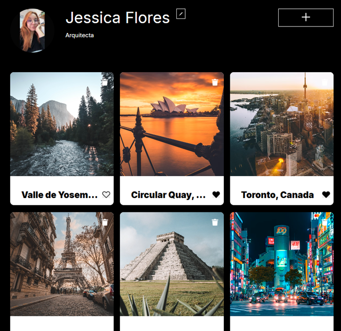
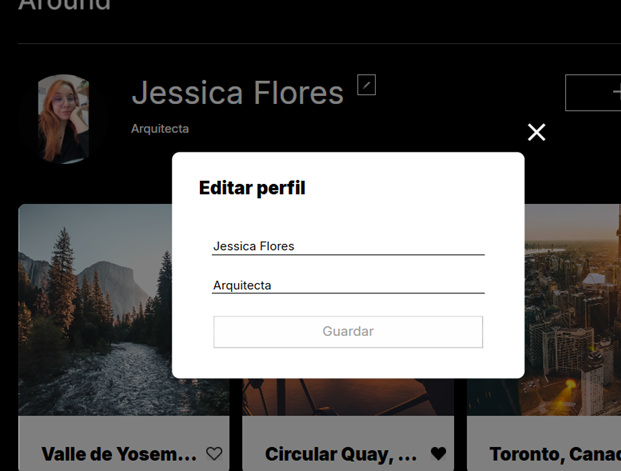
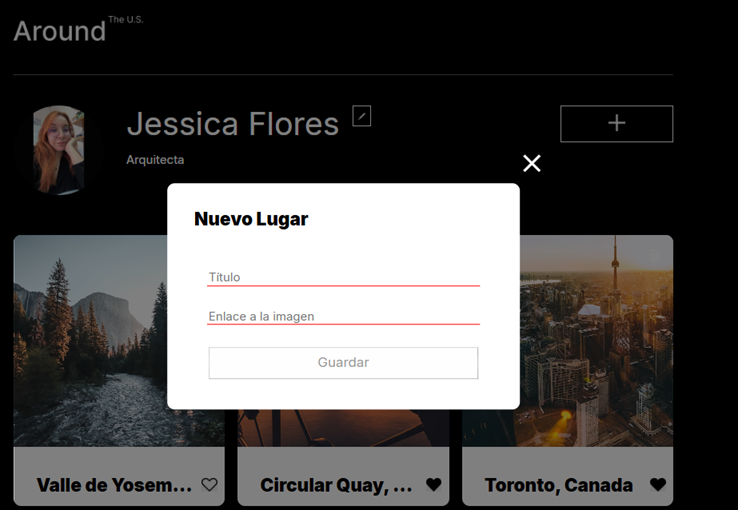
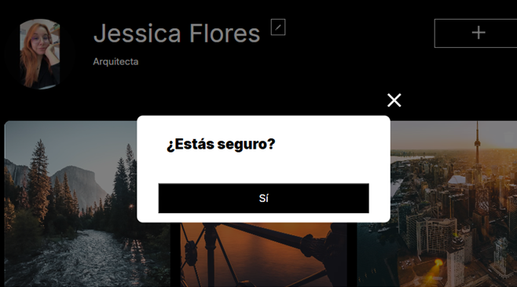
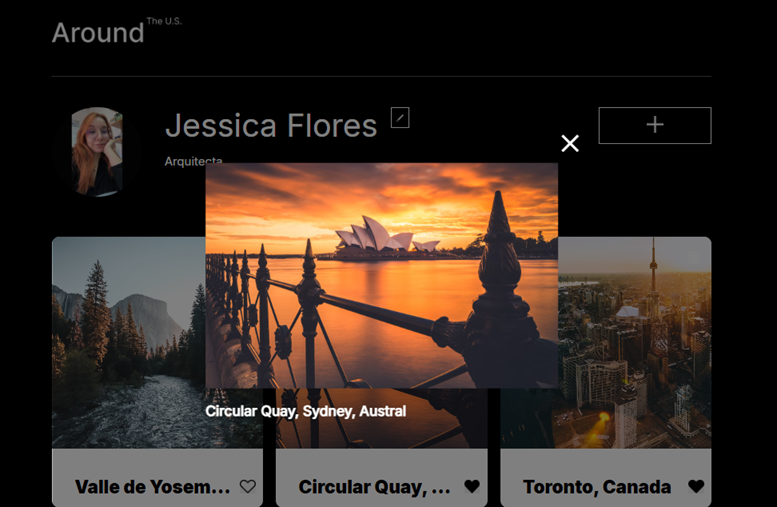

Proyecto :Web_project_around

web_project_around es una aplicación web de red social enfocada en compartir fotos. Los usuarios pueden explorar una galería de imágenes, agregar sus propias fotos con descripciones, editar su perfil personal, dar "me gusta" a las publicaciones de otros y eliminar cards si son dueños de ellas. La app incluye validación de formularios, popups modales para interacciones y una integración con una API para manejar datos dinámicamente.

**Funcionalidades principales:**

- **Galería de cards:** Muestra imágenes con likes, nombres de dueños y opciones de interacción.
- **Edición de perfil:** Actualiza nombre y descripción del usuario mediante un popup.
- **Agregar imagen:** Abre un popup para subir una nueva foto con título.
- **Ver imagen ampliada:** Clic en una card abre un popup con la imagen en grande.
- **Eliminar card:** Confirmación vía popup antes de borrar una publicación.
- **Likes:** Toggle de likes en cada card, con conteo actualizado.
- **Validación de formularios:** Previene envíos inválidos en popups (por ejemplo, campos requeridos y límites de caracteres).

La app es responsive y se carga dinámicamente con datos de una API simulada o real.

## Tecnologías y Técnicas Utilizadas

- **HTML5:** Estructura semántica para la página principal, popups y formularios.
- **CSS3:** Estilos modulares con metodología **BEM (Block-Element-Modifier)** para mantener el código organizado y escalable. Incluye imports de Normalize.css para resetear estilos base y fuentes personalizadas (Inter de Google Fonts).
  - Bloques principales: `page`, `header`, `profile`, `card`, `popup`, `footer`.
  - Ejemplo de nomenclatura BEM: `.card__image` (elemento), `.popup_opened` (modificador).
- **JavaScript (ES6+):** Lógica principal con módulos (import/export), clases orientadas a objetos y promesas para manejo asíncrono.
  - **Clases clave:** `Card` (manejo de cards y likes), `PopupWithForm` (popups con formularios), `User Info` (gestión de datos de usuario), `Section` (renderizado de cards), `FormValidator` (validación de inputs).
  - **API Integration:** Uso de `fetch` para operaciones CRUD (Create, Read, Update, Delete) en endpoints como `/cards` y `/users/me`.
  - **Event Listeners:** Manejo de eventos como clics, submits y teclas (ESC para cerrar popups).

## Imágenes y Capturas de Pantalla

### Página Principal (Galería de Cards)

Vista inicial con header, perfil del usuario y grid de cards con imágenes, likes y botones de eliminar.

### Popup de Edición de Perfil

Popup modal con formulario para actualizar nombre y descripción, con validación en tiempo real.

### Agregar Nueva Imagen

Popup para subir una foto, con preview y campos para título y URL.

### Confirmación de Eliminación

Popup de confirmación antes de borrar una card.

### Imagen Ampliada

Popup con imagen en grande, título y botón de cierre.

##### Autor

Autor:Jessica Flores

Url: https://jessloto95.github.io/web_project_around/

# Tripleten web_project_around
